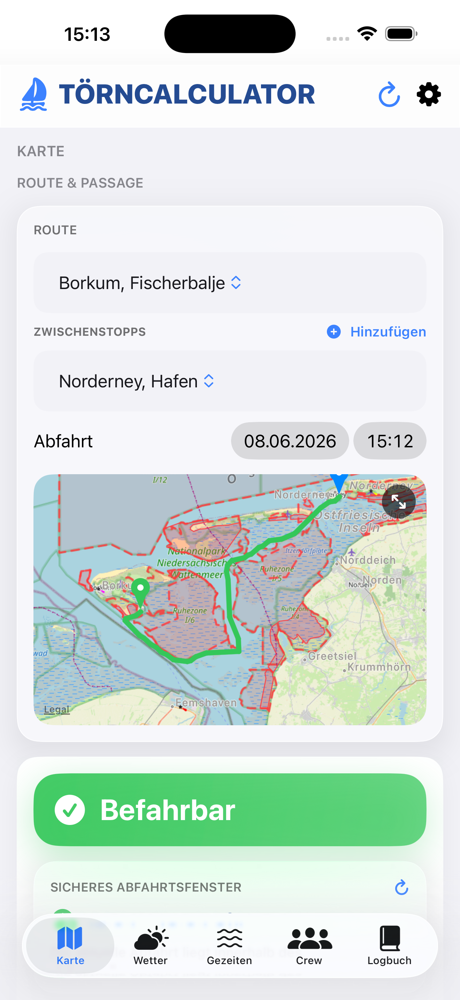
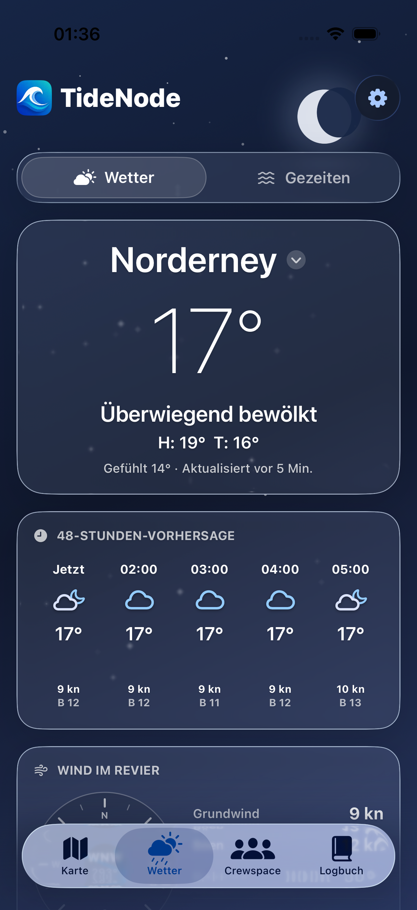
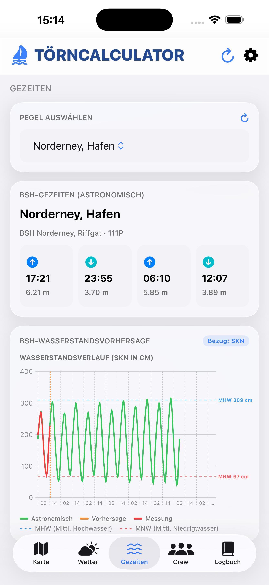
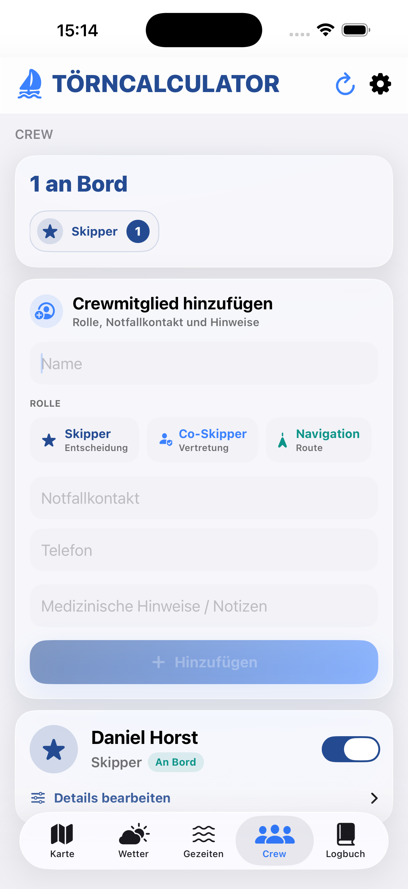
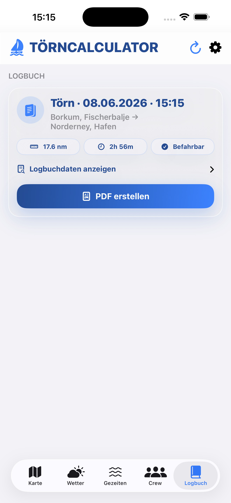
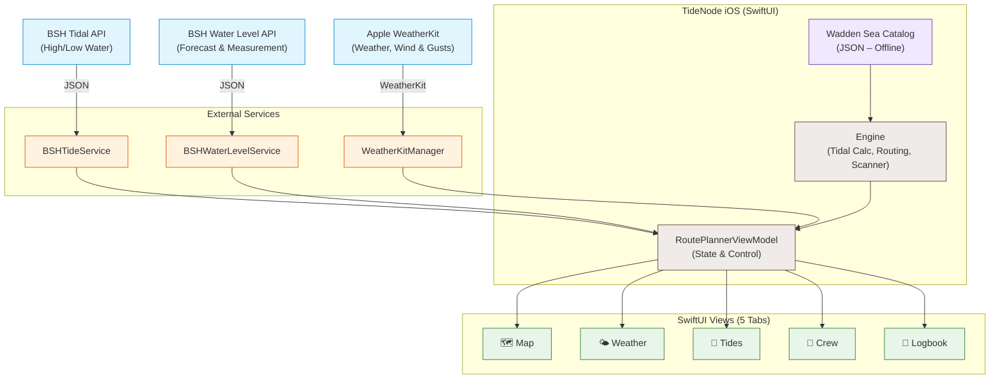
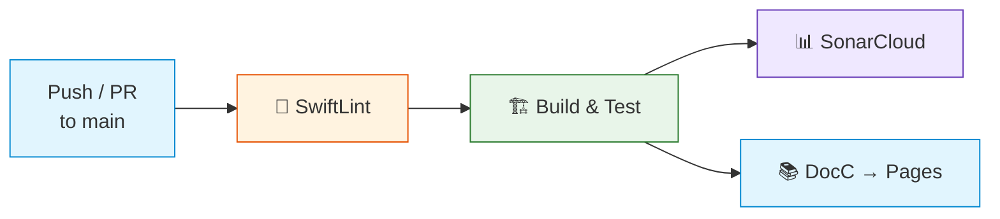

<div align="center">

# TideNode

**Intelligent Passage & Tidal Route Planning for the East Frisian Islands**

[Deutsch](README.md) · **English**

A native iOS app that combines routes, tides, water levels, weather data, and crew information in a modern SwiftUI interface to calculate a transparent **Go / Warning / No-Go** assessment — fully offline-capable with a curated Wadden Sea catalog.

[](https://github.com/everybodydaniel/Toernberechnung-iOS/actions/workflows/ci.yml)
[](https://swift.org)
[](https://developer.apple.com/ios/)
[](#-architecture)
[](https://maplibre.org/)
[](https://everybodydaniel.github.io/Toernberechnung-iOS/documentation/toernberechnung/)
[](LICENSE)

<br/>



<sub><i>Map view: Route Borkum → Norderney with nautical chart, tidal window and Go/No-Go assessment</i></sub>

</div>

> ⚠️ **Disclaimer:** This app is a planning tool. Catalog values, bearing plan values, weather, and tidal data must be verified by the skipper against official sources and current conditions before departure.

---

## 📑 Table of Contents

- [Overview](#-overview)
- [Screenshots](#-screenshots)
- [Highlights](#-highlights)
- [System Architecture](#-system-architecture)
- [Data Sources](#-data-sources)
- [Technology Stack](#-technology-stack)
- [Project Structure](#-project-structure)
- [Setup & Installation](#-setup--installation)
- [Code Quality](#-code-quality)
- [Tests](#-tests)
- [CI/CD Pipeline](#-cicd-pipeline)
- [Documentation](#-documentation)
- [Versioning](#-versioning)
- [License](#-license)

---

## 🎯 Overview

TideNode is a native iOS app for **planning sailing passages and tidal routes** between the East Frisian Islands in the German Wadden Sea. The app targets skippers who need a reliable, data-driven decision basis for their voyage.

The application follows a cleanly decoupled **MVVM architecture** with five main sections:

- **Map** – Nautical chart with route planning, waypoints, and Go/No-Go assessment
- **Weather** – Apple WeatherKit forecasts with 48-hour wind and gust data in knots
- **Tides** – BSH tidal data with astronomical high/low water times and water level forecasts
- **Crew** – Crew management with roles (Skipper, Co-Skipper, Navigator), emergency contacts, and board status
- **Logbook** – Complete ship's log with PDF export and audit trail via SwiftData

---

## 📱 Screenshots

<div align="center">

<table>
  <tr>
    <td align="center"><br/><sub><b>Map</b><br/>Route & Passage</sub></td>
    <td align="center"><br/><sub><b>Weather</b><br/>WeatherKit Forecast</sub></td>
    <td align="center"><br/><sub><b>Tides</b><br/>BSH Tide Calendar</sub></td>
  </tr>
  <tr>
    <td align="center"><br/><sub><b>Crew</b><br/>Crew Management</sub></td>
    <td align="center"><br/><sub><b>Logbook</b><br/>Ship's Log</sub></td>
    <td></td>
  </tr>
</table>

</div>

---

## ✨ Highlights

| | Feature | Description |
|---|---|---|
| 🗺️ | **Nautical Chart** | MapLibre-based map view with route rendering, waypoints, protected zone markings, and fullscreen mode |
| 🧮 | **Tide-Based Calculations** | Automatic computation of fall height (FmW), water depth (WT), and water column above keel (WuK) using the Rule of Twelfths |
| 🔍 | **Passage Window Scanner** | Automatic search for the next safe departure window based on tidal and water level conditions |
| 🌊 | **BSH Tidal Data** | Real-time retrieval of astronomical high/low water predictions and water level curves from the German Federal Maritime and Hydrographic Agency |
| 🌤️ | **Apple WeatherKit** | Current conditions, 48-hour wind forecasts, and seven-day outlooks for all East Frisian Islands |
| ✨ | **Nauti On-Device** | Local skipper assistant powered by Apple Foundation Models on supported iOS 26 devices without sending chat history to an AI server |
| 🚦 | **Go / Warning / No-Go** | Combined assessment from tidal and weather status into a clear passage recommendation |
| 🧭 | **Multi-Leg Routing** | Route planning with intermediate stops and automatic leg calculation via the Wadden Sea catalog |
| 👥 | **Crew Management** | Roles (Skipper, Co-Skipper, Navigator), emergency contacts, and onboard status tracking |
| 📒 | **Digital Logbook** | Ship's log with complete voyage history and PDF export via SwiftData |
| 🗃️ | **Offline Catalog** | Curated Wadden Sea catalog with 20+ routes, waypoints, and depth values |

---

## 🏗️ System Architecture

The app follows an **MVVM architecture** with strict separation between the UI layer, business logic, and external services. The curated Wadden Sea catalog enables core calculations even without network connectivity.



### Key Components

| Layer | Responsibility |
|---|---|
| **Views** | SwiftUI interface with 5-tab navigation, MapLibre map view, and Liquid Glass styling |
| **ViewModel** | `RoutePlannerViewModel` – central state, calculation control, and data fetching |
| **Engine** | Tidal calculations (Rule of Twelfths), route planning, passage window scanning, and status combination |
| **Services** | Clients for BSH tides, BSH water levels, Apple WeatherKit, and local Nauti inference |
| **Resources** | Curated Wadden Sea catalog, GeoJSON protected area data, and nautical chart resources |

---

## 🌐 Data Sources

| Source | Provided Data | Processing |
|---|---|---|
| **BSH Tides** | Astronomical high/low water predictions for island tide gauges | JSON retrieval, parsing of HW/LW times and heights |
| **BSH Water Level** | Water level forecast and measurement (SKN reference) | Time series retrieval, rendered as level curve |
| **Apple WeatherKit** | Current weather, wind, gusts, precipitation, hourly forecasts, and daily outlooks | Native async/await queries, nautical units, and local cache |
| **Apple Foundation Models** | Local language understanding for Nauti, voyage intents, and general seamanship questions | Entirely on device with structured Swift output and no AI network request |
| **Local Catalog** | 20+ routes, waypoints, depth values, and tide gauges | Offline JSON with pre-computed catalog data |

> Core calculations and Nauti responses run locally on supported devices. Tide, weather, and Crewspace data still require an active internet connection.

---

## 🧰 Technology Stack

### App Platform
- **Language:** Swift 5.9
- **UI Framework:** SwiftUI with Liquid Glass styling
- **Minimum Version:** iOS 18.0
- **Persistence:** SwiftData (logbook, crew, audit log)

### Map Rendering
- **Renderer:** MapLibre GL Native 6.26+
- **Map Type:** Nautical chart with GeoJSON overlays
- **Protected Areas:** North Sea protection zone regulation data (GeoJSON)

### External Services
- **Tides:** BSH Tidal API + BSH Water Level API
- **Weather and Wind:** Apple WeatherKit
- **Soundings:** Wadden Sea Sailing Association sounding data

### Local AI
- **Framework:** Apple Foundation Models on iOS 26
- **Privacy:** Nauti prompts and responses never leave the device
- **Fallback:** Manual features remain available on unsupported devices; there is no remote AI fallback

### Calculation Engine
- **Tidal Computation:** Rule of Twelfths for water level interpolation
- **Strategies:** MHW-based and sounding-depth-based
- **Routing:** Multi-leg calculation with automatic route expansion
- **Scanner:** Passage window search across configurable time ranges

### Tooling
- **Project Generation:** XcodeGen 2.30+
- **Code Analysis:** SwiftLint
- **Documentation:** DocC (automatically deployed via GitHub Pages)
- **CI/CD:** GitHub Actions (SwiftLint → Build & Test → SonarCloud → DocC Deploy)
- **Dependencies:** Swift Package Manager (MapLibre, Firebase)

---

## 📂 Project Structure

```text
Toernberechnung-iOS/
├── Toernberechnung/
│   ├── ToernberechnungApp.swift        # App entry point and SwiftData configuration
│   ├── Views/
│   │   ├── ContentView.swift           # Main view with tab navigation
│   │   ├── ContentView+MapTab.swift    # 🗺️ Map tab: route, chart, Go/No-Go
│   │   ├── ContentView+Weather.swift   # 🌤️ Conditions tab: WeatherKit, wind, gusts
│   │   ├── WeatherDetailViews.swift    # Wind map, charts, and daily details
│   │   ├── ContentView+Tides.swift     # 🌊 Tides tab: BSH tides, water level curve
│   │   ├── ContentView+Crew.swift      # 👥 Crew tab: roles, emergency contacts, status
│   │   ├── ContentView+Logbook.swift   # 📒 Logbook tab: voyage history, PDF export
│   │   ├── ContentView+RouteDetail.swift   # Route details and calculation results
│   │   ├── ContentView+SharedUI.swift  # Shared UI components
│   │   ├── CalculatorResultsSection.swift  # Detailed calculation results
│   │   ├── MapView.swift               # MapLibre map integration
│   │   ├── FullScreenMapView.swift     # Fullscreen map view
│   │   ├── FullScreenNavigationView.swift  # Fullscreen navigation
│   │   ├── LiquidGlassStyle.swift      # Glassmorphism UI styles
│   │   └── WebView.swift               # Embedded web view
│   ├── Engine/
│   │   ├── RoutePlannerViewModel.swift  # MVVM ViewModel: state and calculation control
│   │   ├── RouteCalculationService.swift    # Core calculation: times, depths, status
│   │   ├── RoutePlanModels.swift        # Data models for routes and results
│   │   ├── TidalHeightStrategy.swift    # MHW and sounding-depth strategies
│   │   ├── RuleOfTwelfths.swift         # Rule of Twelfths implementation
│   │   ├── PassageWindowScanner.swift   # Automatic departure window search
│   │   ├── SeaRoutePlanner.swift        # Sea chart route planning
│   │   ├── NauticalRouter.swift         # Nautical routing with waypoints
│   │   ├── RouteExpander.swift          # Automatic route expansion
│   │   ├── RouteSummary.swift           # Route calculation summary
│   │   ├── WaddenSeaCatalog.swift       # Wadden Sea catalog parser
│   │   ├── ProtectedZoneCatalog.swift   # Protected zone management
│   │   ├── NavigationTracker.swift      # GPS position tracking
│   │   ├── ActiveVoyageManager.swift    # Active voyage management
│   │   ├── AppDateFormatters.swift      # Central date formatting
│   │   ├── HarbourCatalog.swift         # Neutral harbour and coordinate catalog
│   │   ├── MarineWeatherModels.swift    # Nautical weather domain models
│   │   ├── NautiModels.swift            # Typed local AI actions and availability
│   │   ├── NautiChatViewModel.swift     # Chat state without network dependencies
│   │   └── Routing/                     # Routing algorithms and graphs
│   ├── Services/
│   │   ├── BSHTideService.swift         # BSH tidal API client
│   │   ├── BSHWaterLevelService.swift   # BSH water level measurement data
│   │   ├── BSHWaterLevelForecastService.swift  # BSH water level forecast
│   │   ├── WeatherKitManager.swift      # Apple WeatherKit client and cache
│   │   ├── LocalAIInferenceManager.swift # Apple Foundation Models inference
│   │   ├── WattseglerLotungenService.swift  # Wadden Sea sailing soundings
│   │   ├── EmdenPlantabelleService.swift    # Emden tidal table
│   │   ├── TideDataProvider.swift       # Abstracted tidal data provider
│   │   └── LocationService.swift        # GPS location service
│   └── Resources/
│       ├── wadden_sea_catalog.json      # Curated Wadden Sea catalog
│       ├── east_frisia.geojson          # East Frisia region data
│       ├── east_frisia_osm.geojson      # OSM-based map details
│       ├── nordsbefv.geojson            # North Sea protected zones
│       └── nordsbefv_eastfrisia.geojson # Protected areas East Frisia
├── ToernberechnungTests/
│   └── RouteCalculationTests.swift      # Unit tests for core engine
├── .github/workflows/
│   └── ci.yml                           # CI: SwiftLint → Build & Test → SonarCloud → DocC
├── .swiftlint.yml                       # SwiftLint configuration
├── project.yml                          # XcodeGen project definition
├── Gemfile                              # Ruby dependencies (Fastlane)
├── fastlane/                            # Fastlane configuration
└── LICENSE                              # MIT License
```

---

## 🚀 Setup & Installation

### Prerequisites

| Tool | Version |
|---|---|
| Xcode | 16.0+ |
| iOS Target | 18.0+ |
| Swift | 5.9 |
| XcodeGen | 2.30+ *(optional)* |
| SwiftLint | Latest *(recommended)* |

### 1 · Clone the Repository

```bash
git clone https://github.com/everybodydaniel/Toernberechnung-iOS.git
cd Toernberechnung-iOS
```

### 2 · Generate Xcode Project (optional)

The `.xcodeproj` is included in the repository. Regenerate after changes to `project.yml`:

```bash
# Install XcodeGen (if needed)
brew install xcodegen

# Generate project
xcodegen generate
```

### 3 · Open & Build

```bash
open Toernberechnung.xcodeproj
```

Dependencies (MapLibre and Firebase) are automatically resolved via **Swift Package Manager**.

### 4 · Enable WeatherKit

Enable **WeatherKit** under *Signing & Capabilities* for the app target and for its App ID in the Apple Developer portal. Regenerate the provisioning profile afterwards if necessary.

### 5 · Install SwiftLint (recommended)

```bash
brew install swiftlint
```

> SwiftLint runs automatically as a build phase when installed. Without SwiftLint, the build still succeeds — only a warning is displayed.

---

## 🧹 Code Quality

### SwiftLint

The project uses [SwiftLint](https://github.com/realm/SwiftLint) for static code analysis. Configuration is in `.swiftlint.yml`.

```bash
# Run locally
swiftlint lint --config .swiftlint.yml

# Auto-correct (where possible)
swiftlint --fix --config .swiftlint.yml
```

### DocC Documentation

Swift source code is documented with `///` DocC comments. Build documentation:

```bash
# Via Xcode: Product → Build Documentation (⌃⇧⌘D)

# Via Terminal
xcodebuild docbuild \
  -project Toernberechnung.xcodeproj \
  -scheme Toernberechnung \
  -destination 'platform=iOS Simulator,name=iPhone 16'
```

---

## 🧪 Tests

Unit tests are located in `ToernberechnungTests/` and cover:

- Rule of Twelfths and high water deviations
- Travel times, SOG, and leg calculations
- Combination of tidal and weather status
- Regression tests for Emden → Norderney
- Loading and consistency of the Wadden Sea catalog

```bash
# Run tests via CLI
xcodebuild test \
  -project Toernberechnung.xcodeproj \
  -scheme Toernberechnung \
  -destination 'platform=iOS Simulator,name=iPhone 16'
```

---

## ⚙️ CI/CD Pipeline

The GitHub Actions pipeline (`.github/workflows/ci.yml`) runs on every push/PR to `main`:

| Job | Description |
|---|---|
| 🧹 **SwiftLint** | Static code analysis with GitHub Actions logging |
| 🏗️ **Build & Test** | Compilation, SPM resolution, and unit tests on iOS Simulator |
| 📊 **SonarCloud** | Automated code quality analysis with test reports |
| 📚 **DocC Deploy** | Documentation build and deployment to GitHub Pages |



> All Actions are pinned to full commit SHAs for supply-chain security.

---

## 📚 Documentation

The entire codebase is documented following the DocC standard. The static documentation website is automatically deployed to GitHub Pages on every push:

👉 **[DocC Documentation](https://everybodydaniel.github.io/Toernberechnung-iOS/documentation/toernberechnung/)**

Local generation:

```bash
xcodebuild docbuild \
  -project Toernberechnung.xcodeproj \
  -scheme Toernberechnung \
  -destination 'platform=iOS Simulator,name=iPhone 16'
```

---

## 🔢 Versioning

The project uses [Semantic Versioning](https://semver.org/) (`MAJOR.MINOR.PATCH`):

| Xcode Field | Meaning | Example |
|---|---|---|
| `MARKETING_VERSION` | Public version (SemVer) | `1.0` |
| `CURRENT_PROJECT_VERSION` | Build number (incremental) | `1` |


## 📄 License

Released under the **MIT License**. See [LICENSE](LICENSE) for full terms.

<div align="center">

---

<sub>Copyright © 2026 everybodydaniel</sub><br/>
<sub>Hochschule Osnabrück · Campus Lingen</sub>

</div>
