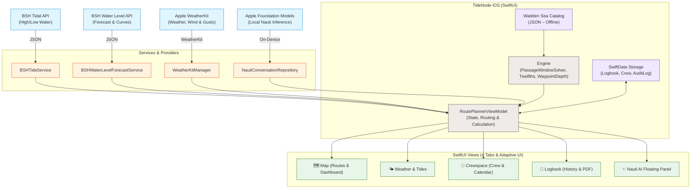
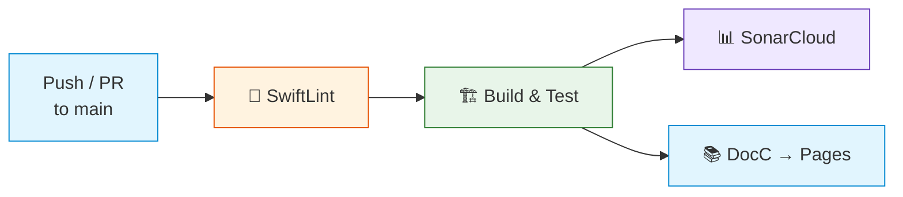

<div align="center">

# TideNode

**Intelligent Passage & Tidal Route Planning for the East Frisian Islands**

[Deutsch](README.md) · **English**

A native iOS app that combines routes, tides, water levels, weather data, and crew information in a modern SwiftUI interface to calculate a transparent **Go / Warning / No-Go** assessment — with a local Wadden Sea catalog and online requests for current data.

[](https://github.com/everybodydaniel/Toernberechnung-iOS/actions/workflows/ci.yml)
[](https://swift.org)
[](https://developer.apple.com/ios/)
[](#-system-architecture)
[](https://developer.apple.com/documentation/mapkit/)
[](https://everybodydaniel.github.io/Toernberechnung-iOS/documentation/toernberechnung/)
[](LICENSE)

<br/>


<sub><i>Map view: Route Borkum → Norderney with nautical chart, computed tidal window and Go/No-Go assessment</i></sub>

</div>

> ⚠️ **Disclaimer:** This app is a planning tool. Catalog values, bearing plan values, weather, and tidal data must be verified by the skipper against official sources and current conditions before departure.

---

## 📑 Table of Contents

- [Overview](#-overview)
- [Screenshots](#-screenshots)
- [Highlights](#-highlights)
- [System Architecture](#-system-architecture)
- [Data Sources](#-data-sources)
- [Technology Stack](#-technology-stack)
- [Project Structure](#-project-structure)
- [Setup & Installation](#-setup--installation)
- [Code Quality](#-code-quality)
- [Tests](#-tests)
- [CI/CD Pipeline](#-cicd-pipeline)
- [Documentation](#-documentation)
- [Versioning](#-versioning)
- [License](#-license)

---

## 🎯 Overview

TideNode is a modern, native iOS app for **planning sailing passages and tidal routes** between the East Frisian Islands in the German Wadden Sea. The app targets skippers who need a reliable, data-driven decision basis for challenging tidal waters.

The application follows a cleanly decoupled **MVVM architecture** organized into four harmoniously integrated primary sections:

- **🗺️ Map** – MapKit-based nautical chart with interactive multi-leg route planning, waypoints, protected zone overlays (NordsBefV), depth profiles, and Go / Warning / No-Go status indicators
- **🌤️ Weather & Tides** – Apple WeatherKit forecasts featuring 48-hour wind and gust charts in knots combined with official BSH tidal data, astronomical high/low water times, and water level forecast curves
- **👥 Crewspace** – Local crew management with roles (Skipper, Co-Skipper, Navigator, Deckhand), emergency contacts, phone numbers, onboard status ("On Board"), and integrated monthly appointment planning
- **📒 Logbook** – Digital ship's logbook with complete passage history, automatic voyage logging from planned trips, and PDF export via SwiftData

---

## 📱 Screenshots

<div align="center">

<table>
  <tr>
    <td align="center"><br/><sub><b>Map</b><br/>Route & Passage</sub></td>
    <td align="center"><br/><sub><b>Weather</b><br/>WeatherKit Forecast</sub></td>
    <td align="center"><br/><sub><b>Tides</b><br/>BSH Tide Calendar</sub></td>
  </tr>
  <tr>
    <td align="center"><br/><sub><b>Crewspace</b><br/>Crew & Planning</sub></td>
    <td align="center"><br/><sub><b>Logbook</b><br/>Ship's Log</sub></td>
    <td></td>
  </tr>
</table>

</div>

---

## ✨ Highlights

| | Feature | Description |
|---|---|---|
| 🗺️ | **Nautical Chart** | MapKit-based chart view with route vectors, waypoints, environmental protection zones, and fullscreen navigation mode |
| 🧮 | **Tide-Based Calculations** | Automatic computation of fall height (FmW), water depth (WT), and water column above keel (WuK) using the Rule of Twelfths, factoring in draft and safety margin |
| 🔍 | **Passage Window Solver** | Automatic search for the optimal safe departure window based on tidal and water level predictions |
| 🌊 | **BSH Tidal Data** | Direct retrieval of astronomical high/low water predictions for all island gauges (Borkum, Juist, Norderney, Baltrum, Langeoog, Spiekeroog, Wangerooge, Emden) |
| 🌤️ | **Apple WeatherKit** | Real-time weather, 48-hour wind forecasts, gust indicators, and 7-day outlook in nautical units (knots, Beaufort) |
| ✨ | **Nauti On-Device** | Local skipper assistant powered by Apple Foundation Models on supported iOS 26 devices with text input — no external AI server upload |
| 🚦 | **Go / Warning / No-Go** | Clear composite recommendation combining depth over seabed, sea state, and weather conditions |
| 🧭 | **Multi-Leg Routing** | Route planning with flexible intermediate stops and automatic leg calculation via the Wadden Sea catalog |
| 📱 | **Responsive iPad Layout** | Adaptive interface with floating tab bar, wide multi-column controls, and optimized popovers for iPad and iPhone |
| 👥 | **Crewspace & Schedule** | Roles, emergency contacts, onboard status, and voyage scheduling with monthly calendar — zero cloud dependency, 100% on-device |
| 📒 | **Digital Logbook** | Ship's log with complete voyage history, audit trail, and print-ready PDF export via SwiftData |
| 🗃️ | **Offline Catalog** | Curated Wadden Sea catalog with 20+ routes, waypoints, charted depths, and alternate ports |

---

## 🏗️ System Architecture

The app follows an **MVVM architecture** with strict decoupling between the UI layer, business logic, and external data providers. The curated Wadden Sea catalog enables core calculations even without an internet connection.



### Key Components

| Layer | Responsibility |
|---|---|
| **Views** | SwiftUI interface with 4 tabs (Map, Weather/Tides, Crewspace, Logbook), floating tab bar, iPad layout, and Liquid Glass design |
| **ViewModel** | `RoutePlannerViewModel`, `NautiChatViewModel` – central state, calculation management, and service orchestration |
| **Engine** | `PassageWindowSolver`, `RuleOfTwelfths`, `WaypointDepthSolver`, `NauticalRouter` – tidal calculations, waypoint depths, and route expansion |
| **Services** | Clients for BSH tides, BSH water level forecasts, Apple WeatherKit, Wattsegler depth soundings, and speech/AI inference |
| **Resources** | Curated Wadden Sea catalog (`wadden_sea_catalog.json`), protected zone GeoJSON (`nordsbefv.geojson`), and nautical chart resources |

---

## 🌐 Data Sources

| Source | Provided Data | Processing |
|---|---|---|
| **BSH Tides** | Astronomical high/low water predictions for island tide gauges | JSON fetch, parsing HW/NW times and heights referenced to Chart Datum (LAT / SKN) |
| **BSH Water Level** | Water level forecast and water level measurements | Time series interpolation (`WaterLevelCorrectionSeries`), trend curve visualization |
| **Apple WeatherKit** | Current weather, wind speed, gusts, direction, and hourly/7-day forecasts | Native async/await requests, nautical conversion (knots, Beaufort), and intelligent memory/disk caching |
| **Apple Foundation Models** | Local natural language and maritime understanding for Nauti (intent routing, tidal inquiries) | 100% on-device; structured actions (`NautiModels`) without internet transmission |
| **Local Catalog** | 20+ routes, waypoints, depth soundings, and gauges | Offline JSON with pre-calculated distances, target depths, and alternate routes |

---

## 🧰 Technology Stack

### App Platform
- **Language:** Swift 5.9 (Swift 6 ready)
- **UI Framework:** SwiftUI with Liquid Glassmorphism and adaptive iPad layouts
- **Minimum Target:** iOS 18.0 (with Foundation Models features on iOS 26+)
- **Persistence:** SwiftData (Logbook, Crew Roster, Appointments, AuditLog)

### Chart & Mapping
- **Rendering:** MapKit with OpenStreetMap and OpenSeaMap tiles
- **Chart Style:** Nautical chart with custom vector and raster tile styling
- **Protected Zones:** North Sea Protection Ordinance (GeoJSON layers for Zone I and II)

### Calculation Engine
- **Tidal Computation:** Rule of Twelfths with cubic/linear height interpolation
- **Depth Model:** Integration of vessel draft, safety margin, and MHW/SKN references
- **Passage Solver:** Automated scanning for passable time windows per waypoint
- **Routing:** A* pathfinding and nautical waypoint routing with buoy validation

### Tooling & QA
- **Project Generation:** XcodeGen 2.30+
- **Static Analysis:** SwiftLint (automatic build phase)
- **Documentation:** DocC (automatically deployed to GitHub Pages)
- **Testing:** XCTest (128 Unit Tests) & XCUITest (automated UI and screenshot tests)
- **CI/CD:** GitHub Actions (SwiftLint → Build & Test → SonarCloud → DocC Deploy)

---

## 📂 Project Structure

```text
Toernberechnung-iOS/
├── Toernberechnung/
│   ├── ToernberechnungApp.swift             # App entry point, onboarding & SwiftData setup
│   ├── Views/
│   │   ├── ContentView.swift                # Main navigation (4 tabs), iPad detection & scroll header
│   │   ├── ContentView+MapTab.swift         # 🗺️ Map tab: Nautical chart, route planning & live dashboard
│   │   ├── ContentView+Weather.swift        # 🌤️ Weather & Tides: WeatherKit, compass rose, 48h forecast
│   │   ├── ContentView+Tides.swift          # 🌊 Tides view: BSH gauges, HW/NW cards, water levels
│   │   ├── ContentView+Crew.swift           # 👥 Crewspace: Roster, emergency contacts & onboard status
│   │   ├── ContentView+Logbook.swift        # 📒 Logbook: Voyage history, travel log & PDF export
│   │   ├── ContentView+Nauti.swift          # ✨ Nauti AI: Floating launcher & binding
│   │   ├── ContentView+NautiDrawer.swift    # Nauti AI side-drawer and chat panel
│   │   ├── ContentView+FloatingTabBar.swift # Floating glass tab bar with label support
│   │   ├── ContentView+SharedUI.swift       # Shared UI components, menus & boat settings
│   │   ├── CrewEventEditor.swift            # Appointment editor for Crewspace scheduling
│   │   ├── CrewPlanningView.swift           # Monthly calendar & schedule overview
│   │   ├── NautiChatView.swift              # AI chat interface with speech output
│   │   ├── NautiPremiumChatView.swift       # Full-screen chat with context actions
│   │   ├── MapView.swift                    # MapKit chart integration
│   │   ├── LiquidGlassStyle.swift           # Glassmorphism design system
│   │   └── WeatherDetailViews.swift         # Detail cards for wind, gusts, and pressure
│   ├── Engine/
│   │   ├── RoutePlannerViewModel.swift       # MVVM view model for passage planning & calculations
│   │   ├── RoutePlannerViewModel+Support.swift # Helper functions for waypoints and harbours
│   │   ├── PassageWindowSolver.swift        # Solver for safe departure time windows
│   │   ├── RouteCalculationService.swift    # Core calculation: depths, travel times, Go/No-Go
│   │   ├── RoutePlanModels.swift            # Data models for routes, segments, and results
│   │   ├── WaypointDepthSolver.swift        # Dynamic depth resolution per waypoint
│   │   ├── WaypointTideContext.swift        # Tidal context for waypoints
│   │   ├── RuleOfTwelfths.swift             # Rule of Twelfths implementation
│   │   ├── TidalHeightStrategy.swift        # MHW and charted depth calculation strategies
│   │   ├── HarbourCatalog.swift             # Island and mainland harbours with gauge mappings
│   │   ├── NauticalRouter.swift             # Nautical routing and buoy validation
│   │   ├── RouteExpander.swift              # Automatic route expansion
│   │   ├── WaddenSeaCatalog.swift           # Parser for the curated Wadden Sea catalog
│   │   ├── NautiChatViewModel.swift         # State management for on-device Nauti assistant
│   │   ├── NautiModels.swift                # Typed intents and actions
│   │   ├── NautiDeterministicIntentRouter.swift # Deterministic intent router
│   │   └── Routing/                         # A* pathfinder, sea masks & path smoothing
│   ├── Services/
│   │   ├── BSHTideService.swift             # Client for BSH tidal predictions
│   │   ├── BSHWaterLevelForecastService.swift # BSH water level forecasts
│   │   ├── WeatherKitManager.swift          # Apple WeatherKit manager with caching
│   │   ├── LocalAIInferenceManager.swift    # On-device Foundation Models inference
│   │   ├── NautiConversationRepository.swift # Local persistence of chat conversations
│   │   ├── WaterLevelCorrectionSeries.swift # Time series interpolation for water levels
│   │   └── LocationService.swift            # CoreLocation service for GPS tracking
│   └── Resources/
│       ├── wadden_sea_catalog.json          # Curated Wadden Sea route catalog
│       ├── nordsbefv.geojson                # Protection zones of the North Sea Ordinance
│       ├── east_frisia.geojson              # East Frisian coastline and islands
│       └── PrivacyInfo.xcprivacy            # Apple Privacy Manifest
├── ToernberechnungTests/                    # 15 test suites with 128 unit tests
│   ├── ExcelParityDepthChainTests.swift     # Parity tests with Excel calculation chain
│   ├── ExcelParityRouteTests.swift          # Route verification and reference tests
│   ├── PassageWindowSolverTests.swift       # Validation of the passage window solver
│   ├── WeatherKitMigrationTests.swift       # Caching, spatial grid, and nautical units
│   ├── BSHTideMigrationTests.swift          # BSH parser and gauge assignment
│   └── ...
├── ToernberechnungUITests/                  # Automated XCUITest UI tests
│   └── WeatherRevierUITests.swift           # UI tests, onboarding & screenshot generator
├── assets/screenshots/                     # High-resolution screenshots of the app
├── .github/workflows/ci.yml                 # CI pipeline (SwiftLint → Tests → SonarCloud → DocC)
├── project.yml                              # XcodeGen specification
└── LICENSE                                  # MIT License
```

---

## 🚀 Setup & Installation

### Prerequisites

| Tool | Version |
|---|---|
| macOS | 14.5+ (Sonoma) or 15.0+ (Sequoia) |
| Xcode | 16.0+ |
| iOS Target | 18.0+ |
| Swift | 5.9+ |
| XcodeGen | 2.30+ *(optional)* |

### 1 · Clone Repository

```bash
git clone https://github.com/everybodydaniel/Toernberechnung-iOS.git
cd Toernberechnung-iOS
```

### 2 · Open & Build Project in Xcode

The preconfigured project `Toernberechnung.xcodeproj` is included directly in the repository:

```bash
open Toernberechnung.xcodeproj
```

The map uses MapKit with OpenStreetMap and OpenSeaMap tiles. Required source files are included in the Xcode project.

*(Optional)* If changes are made to `project.yml`, regenerate the project with XcodeGen:

```bash
brew install xcodegen
xcodegen generate
```

### 3 · WeatherKit Capability

Under *Signing & Capabilities* in the Xcode target **Toernberechnung**, ensure that the *WeatherKit* capability is enabled and assigned to a valid Apple Developer Team.

---

## 🧪 Tests & Quality Assurance

### Unit Tests

The test suite includes **128 automated unit tests** verifying mathematical calculations, tidal interpolation, caching, and data parity:

```bash
xcodebuild test \
  -scheme ToernberechnungTests \
  -destination 'platform=iOS Simulator,name=iPhone 17'
```

### UI Tests & Screenshot Generation

The XCUITest suite validates tab navigation, onboarding, iPad layouts, and dark mode rendering. Documentation screenshots can be generated reproducibly in the simulator at any time using `testGenerateReadmeScreenshots`:

```bash
xcodebuild test \
  -scheme ToernberechnungUITests \
  -destination 'platform=iOS Simulator,name=iPhone 17' \
  -only-testing:ToernberechnungUITests/WeatherRevierUITests/testGenerateReadmeScreenshots
```

### SwiftLint

```bash
# Run linting
swiftlint lint --config .swiftlint.yml
```

---

## ⚙️ CI/CD Pipeline

The GitHub Actions pipeline (`.github/workflows/ci.yml`) automatically protects every commit and pull request on `main`:



1. **SwiftLint** – Code style and convention enforcement
2. **Build & Test** – Building iOS targets and executing test suites in the iOS Simulator
3. **SonarCloud** – Static analysis and quality gate reporting
4. **DocC Deployment** – Automated publishing of interactive Swift documentation to GitHub Pages

---

## 📚 Documentation

Complete developer documentation is available as a DocC catalog:

👉 **[View DocC Documentation](https://everybodydaniel.github.io/Toernberechnung-iOS/documentation/toernberechnung/)**

---

## 📄 License

Distributed under the **MIT License**. See [LICENSE](LICENSE) for details.

<div align="center">

---

<sub>Copyright © 2026 everybodydaniel</sub><br/>
<sub>Osnabrück University of Applied Sciences · Campus Lingen</sub>

</div>
