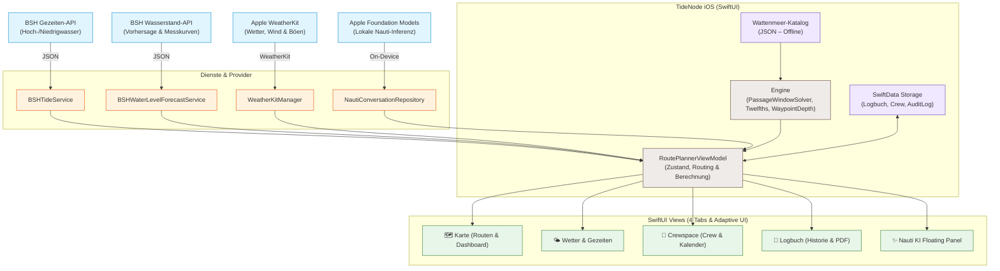
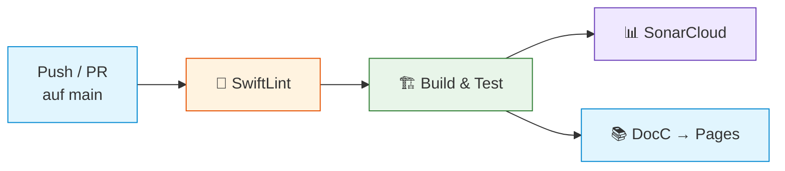

<div align="center">

# TideNode

**Intelligente Törn- & Wattenpassageplanung für die ostfriesischen Inseln**

**Deutsch** · [English](README.en.md)

Eine native iOS-App, die Routen, Gezeiten, Wasserstände, Wetterdaten und Bordinformationen in einer modernen SwiftUI-Oberfläche vereint und daraus eine nachvollziehbare **Go / Warning / No-Go**-Einschätzung berechnet – mit lokalem Wattenmeer-Katalog und Online-Abfragen für aktuelle Daten.

[](https://github.com/everybodydaniel/Toernberechnung-iOS/actions/workflows/ci.yml)
[](https://swift.org)
[](https://developer.apple.com/ios/)
[](#-systemarchitektur)
[](https://developer.apple.com/documentation/mapkit/)
[](https://everybodydaniel.github.io/Toernberechnung-iOS/documentation/toernberechnung/)
[](LICENSE)

<br/>


<sub><i>Kartenansicht: Route Borkum → Norderney mit nautischer Seekarte, berechnetem Gezeitenfenster und Go/No-Go-Bewertung</i></sub>

</div>

> ⚠️ **Hinweis:** Die App ist ein Planungstool. Katalogwerte, Peilplanwerte, Wetter- und Gezeitendaten müssen vor der Fahrt skipperseitig mit offiziellen Quellen und der aktuellen Lage abgeglichen werden.

---

## 📑 Inhaltsverzeichnis

- [Überblick](#-überblick)
- [Screenshots](#-screenshots)
- [Highlights](#-highlights)
- [Systemarchitektur](#-systemarchitektur)
- [Datenquellen](#-datenquellen)
- [Technologie-Stack](#-technologie-stack)
- [Projektstruktur](#-projektstruktur)
- [Setup & Installation](#-setup--installation)
- [Code Quality](#-code-quality)
- [Tests](#-tests)
- [CI/CD Pipeline](#-cicd-pipeline)
- [Dokumentation](#-dokumentation)
- [Versionierung](#-versionierung)
- [Lizenz](#-lizenz)

---

## 🎯 Überblick

TideNode ist eine moderne, native iOS-App für die **Planung von Segeltörns und Wattenpassagen** zwischen den ostfriesischen Inseln im deutschen Wattenmeer. Die App richtet sich an Skipper, die eine zuverlässige, datenbasierte Entscheidungsgrundlage für anspruchsvolle Gezeitengewässer benötigen.

Die Anwendung folgt einer klar entkoppelten **MVVM-Architektur** mit vier harmonisch integrierten Kernbereichen:

- **🗺️ Karte** – MapKit-basierte nautische Seekarte mit interaktiver Mehrstrecken-Routenplanung, Wegpunkten, Schutzzonenmarkierungen, Tiefenprofil und Go / Warning / No-Go Statusanzeige
- **🌤️ Wetter & Gezeiten** – Apple-WeatherKit-Prognosen mit 48-Stunden-Wind- und Böendiagrammen in Knoten kombiniert mit offiziellen BSH-Gezeitendaten, astronomischen Hoch-/Niedrigwasserzeiten und Wasserstandsvorhersagekurven
- **👥 Crewspace** – Lokale Crewverwaltung mit Rollen (Skipper, Co-Skipper, Navigation, Deck), Notfallkontakten, Telefonnummern, Bordstatus ("An Bord") sowie integrierter Monats-Terminplanung
- **📒 Logbuch** – Digitales Schiffstagebuch mit vollständiger Törnhistorie, automatischer Übernahme berechneter Fahrten und PDF-Export via SwiftData

---

## 📱 Screenshots

<div align="center">

<table>
  <tr>
    <td align="center"><br/><sub><b>Karte</b><br/>Route & Passage</sub></td>
    <td align="center"><br/><sub><b>Wetter</b><br/>WeatherKit-Prognose</sub></td>
    <td align="center"><br/><sub><b>Gezeiten</b><br/>BSH-Tidenkalender</sub></td>
  </tr>
  <tr>
    <td align="center"><br/><sub><b>Crewspace</b><br/>Crew & Termine</sub></td>
    <td align="center"><br/><sub><b>Logbuch</b><br/>Schiffstagebuch</sub></td>
    <td></td>
  </tr>
</table>

</div>

---

## ✨ Highlights

| | Feature | Beschreibung |
|---|---|---|
| 🗺️ | **Nautische Seekarte** | MapKit-basierte Kartenansicht mit Kartendarstellung, Routenvektoren, Wegpunkten, Schutzzonen (Nordseebefundverordnung) und Vollbildmodus |
| 🧮 | **Gezeitenbasierte Berechnung** | Automatische Berechnung von Fallhöhe (FmW), Wassertiefe (WT) und Wassersäule über Kiel (WuK) nach der Zwölftelregel unter Berücksichtigung von Tiefgang und Sicherheitsmarge |
| 🔍 | **Passagefenster-Solver** | Automatische Suche nach dem optimalen und sicheren Abfahrtsfenster basierend auf Gezeiten und Wasserstandsvorhersage |
| 🌊 | **BSH-Gezeitendaten** | Direkter Abruf astronomischer Hoch-/Niedrigwasservorhersagen für alle Inselpegel (Borkum, Juist, Norderney, Baltrum, Langeoog, Spiekeroog, Wangerooge, Emden) |
| 🌤️ | **Apple WeatherKit** | Echtzeit-Wetter, 48-Stunden-Windprognose, Böenanzeige und 7-Tage-Vorhersage in nautischen Einheiten (Knoten, Bft) |
| ✨ | **Nauti On-Device** | Lokale Skipper-Assistenz über Apple Foundation Models auf unterstützten iOS-26-Geräten mit Texteingabe – vollständig offline ohne Server-Upload |
| 🚦 | **Go / Warning / No-Go** | Transparente Gesamteinschätzung aus Gezeitentiefe, Seegang und Wetterbedingungen zu einer klaren Passage-Empfehlung |
| 🧭 | **Mehrstrecken-Routing** | Routenplanung mit flexiblen Zwischenstopps und automatischer Etappenberechnung über den Wattenmeer-Katalog |
| 📱 | **Responsive iPad-Layout** | Adaptive Oberfläche mit schwebender Tab-Leiste, Mehrspalten-Controls und optimierten Popovers für iPad und iPhone |
| 👥 | **Crewspace & Termine** | Rollen, Notfallkontakte, Bordstatus und Törnterminplanung mit Kalender – ohne Cloud-Zwang, 100 % auf dem Gerät |
| 📒 | **Digitales Logbuch** | Schiffstagebuch mit Fahrthistorie, Auditprotokoll und druckfertigem PDF-Export via SwiftData |
| 🗃️ | **Offline-Katalog** | Kuratierter Wattenmeer-Katalog mit 20+ Routen, Wegpunkten, Tiefenwerten und Ausweichhäfen |

---

## 🏗️ Systemarchitektur

Die App folgt einer **MVVM-Architektur** mit strikter Entkopplung zwischen UI-Schicht, Geschäftslogik und externen Datenanbietern. Der kuratierte Wattenmeer-Katalog ermöglicht die Kernberechnung auch komplett ohne Internetverbindung.



### Schlüsselkomponenten

| Schicht | Verantwortung |
|---|---|
| **Views** | SwiftUI-Oberfläche mit 4 Tabs (Karte, Wetter/Gezeiten, Crewspace, Logbuch), schwebender TabBar, iPad-Layout und Liquid-Glass-Design |
| **ViewModel** | `RoutePlannerViewModel`, `NautiChatViewModel` – zentraler Zustand, Berechnungssteuerung und Datenorchestrierung |
| **Engine** | `PassageWindowSolver`, `RuleOfTwelfths`, `WaypointDepthSolver`, `NauticalRouter` – mathematische Tidenberechnung, Wegpunkttiefen und Routenexpansion |
| **Services** | Clients für BSH-Gezeiten, BSH-Wasserstandsprognosen, Apple WeatherKit, Wattsegler-Lotungen sowie Sprach- und KI-Inferenz |
| **Resources** | Kuratierter Wattenmeer-Katalog (`wadden_sea_catalog.json`), Schutzzonen-GeoJSON (`nordsbefv.geojson`) und nautische Kartenressourcen |

---

## 🌐 Datenquellen

| Quelle | Bereitgestellte Daten | Verarbeitung |
|---|---|---|
| **BSH Gezeiten** | Astronomische Hoch-/Niedrigwasser-Vorhersagen für Inselpegel | JSON-Abruf, Parsing der HW/NW-Zeiten und -Höhen bezogen auf Seekartennull (SKN) |
| **BSH Wasserstand** | Wasserstandsvorhersage und -messung (SKN-Bezug) | Zeitreihen-Interpolation (`WaterLevelCorrectionSeries`), Darstellung als Verlaufskurve |
| **Apple WeatherKit** | Aktuelles Wetter, Windgeschwindigkeit, Böen, Windrichtung sowie Stunden- und 7-Tage-Prognosen | Native async/await-Abfragen, nautische Konvertierung (Knoten, Beaufort) und intelligenter In-Memory-/Disk-Cache |
| **Apple Foundation Models** | Lokales Sprach- und Situationsverständnis für Nauti (Törnabsichten, Gezeitenfragen) | Vollständig auf dem Gerät; typisierte Aktionen (`NautiModels`) ohne Übertragung ins Internet |
| **Lokaler Katalog** | 20+ Routen, Wegpunkte, Tiefenwerte und Pegel | Offline-JSON mit vorberechneten Distanzen, Solltiefen und Ausweichoptionen |

---

## 🧰 Technologie-Stack

### App-Plattform
- **Sprache:** Swift 5.9 (Swift 6 ready)
- **UI-Framework:** SwiftUI mit Liquid-Glassmorphismus und adaptiven iPad-Layouts
- **Mindestversion:** iOS 18.0 (mit Foundation-Models-Features auf iOS 26+)
- **Persistenz:** SwiftData (Logbuch, Crew-Roster, Termine, AuditLog)

### Kartendarstellung
- **Rendering:** MapKit mit OpenStreetMap- und OpenSeaMap-Kacheln
- **Kartentyp:** Nautische Seekarte mit benutzerdefinierten Vektor- und Rasterkacheln
- **Schutzzonen:** Nordseebefundverordnung (GeoJSON-Layer mit Zonen I und II)

### Berechnungs-Engine
- **Tidenberechnung:** Zwölftelregel mit kubischer/linearer Höheninterpolation
- **Tiefenmodell:** Berücksichtigung von Schiffstiefgang, Sicherheitsmarge und MHW/SKN-Referenz
- **Passage-Solver:** Automatischer Scan nach befahrbaren Zeitfenstern je Wegpunkt
- **Routing:** A*-Wegfindung und Nautisches Routing mit Tonnenvalidierung

### Werkzeuge & Qualitätssicherung
- **Projektgenerierung:** XcodeGen 2.30+
- **Code-Analyse:** SwiftLint (automatische Build-Phase)
- **Dokumentation:** DocC (automatisch auf GitHub Pages bereitgestellt)
- **Testing:** XCTest (128 Unit-Tests) & XCUITest (automatisierte UI- und Screenshot-Tests)
- **CI/CD:** GitHub Actions (SwiftLint → Build & Test → SonarCloud → DocC Deploy)

---

## 📂 Projektstruktur

```text
Toernberechnung-iOS/
├── Toernberechnung/
│   ├── ToernberechnungApp.swift             # App-Einstiegspunkt, Onboarding & SwiftData-Setup
│   ├── Views/
│   │   ├── ContentView.swift                # Hauptnavigation (4 Tabs), iPad-Erkennung & Scroll-Header
│   │   ├── ContentView+MapTab.swift         # 🗺️ Karten-Tab: Seekarte, Routenplanung & Live-Dashboard
│   │   ├── ContentView+Weather.swift        # 🌤️ Wetter & Gezeiten: WeatherKit, Windrose, 48h-Vorhersage
│   │   ├── ContentView+Tides.swift          # 🌊 Gezeitenansicht: BSH-Pegel, HW/NW-Karten, Wasserstand
│   │   ├── ContentView+Crew.swift           # 👥 Crewspace: Roster, Notfallkontakte & Bordstatus
│   │   ├── ContentView+Logbook.swift        # 📒 Logbuch: Fahrtenbuch, Reisetagebuch & PDF-Export
│   │   ├── ContentView+Nauti.swift          # ✨ Nauti KI: Floating Launcher & Anbindung
│   │   ├── ContentView+NautiDrawer.swift    # Nauti KI Side-Drawer und Chat-Panel
│   │   ├── ContentView+FloatingTabBar.swift # Schwebende Glas-Tab-Leiste mit Label-Unterstützung
│   │   ├── ContentView+SharedUI.swift       # Gemeinsame UI-Elemente, Menüs & Bootseinstellungen
│   │   ├── CrewEventEditor.swift            # Termineditor für Crewspace-Planung
│   │   ├── CrewPlanningView.swift           # Monatskalender & Terminübersicht
│   │   ├── NautiChatView.swift              # KI-Chatoberfläche mit Sprachausgabe
│   │   ├── NautiPremiumChatView.swift       # Vollbild-Chat mit Kontextaktionen
│   │   ├── MapView.swift                    # MapKit-Kartenintegration
│   │   ├── LiquidGlassStyle.swift           # Glasmorphismus-Designsystem
│   │   └── WeatherDetailViews.swift         # Detailkarten für Wind, Böen und Luftdruck
│   ├── Engine/
│   │   ├── RoutePlannerViewModel.swift       # MVVM-ViewModel für Törnplanung und Berechnungen
│   │   ├── RoutePlannerViewModel+Support.swift # Hilfsfunktionen für Wegpunkte und Häfen
│   │   ├── PassageWindowSolver.swift        # Solver für sichere Abfahrtszeitfenster
│   │   ├── RouteCalculationService.swift    # Kernberechnung: Tiefen, Zeiten, Go/No-Go
│   │   ├── RoutePlanModels.swift            # Datenmodelle für Routen, Segmente und Resultate
│   │   ├── WaypointDepthSolver.swift        # Dynamische Tiefenauflösung pro Wegpunkt
│   │   ├── WaypointTideContext.swift        # Gezeitenkontext für Wegpunkte
│   │   ├── RuleOfTwelfths.swift             # Zwölftelregel-Berechnung
│   │   ├── TidalHeightStrategy.swift        # MHW- und Lottiefe-Berechnungsstrategien
│   │   ├── HarbourCatalog.swift             # Insel- und Festlandshäfen mit Pegelzuordnung
│   │   ├── NauticalRouter.swift             # Nautisches Routing und Tonnenabgleich
│   │   ├── RouteExpander.swift              # Automatische Routenexpansion
│   │   ├── WaddenSeaCatalog.swift           # Parser für den Wattenmeer-Katalog
│   │   ├── NautiChatViewModel.swift         # Zustandsverwaltung für Nauti On-Device
│   │   ├── NautiModels.swift                # Typisierte Intentionen und Aktionen
│   │   ├── NautiDeterministicIntentRouter.swift # Deterministische Aktionsauflösung
│   │   └── Routing/                         # A*-Pathfinder, Seemasken & Wegglättung
│   ├── Services/
│   │   ├── BSHTideService.swift             # Client für BSH-Gezeitendaten
│   │   ├── BSHWaterLevelForecastService.swift # BSH-Wasserstandsvorhersage
│   │   ├── WeatherKitManager.swift          # Apple WeatherKit Manager mit Caching
│   │   ├── LocalAIInferenceManager.swift    # On-Device Foundation Models Inferenz
│   │   ├── NautiConversationRepository.swift # Lokale Speicherung von Chatverläufen
│   │   ├── WaterLevelCorrectionSeries.swift # Zeitreihen-Interpolation für Wasserstände
│   │   └── LocationService.swift            # CoreLocation-Dienst für GPS-Tracking
│   └── Resources/
│       ├── wadden_sea_catalog.json          # Kuratierter Wattenmeer-Routenkatalog
│       ├── nordsbefv.geojson                # Schutzzonen der Nordseebefundverordnung
│       ├── east_frisia.geojson              # Ostfriesische Küstenlinie und Inseln
│       └── PrivacyInfo.xcprivacy            # Apple Privacy Manifest
├── ToernberechnungTests/                    # 15 Testsuiten mit 128 Unit-Tests
│   ├── ExcelParityDepthChainTests.swift     # Paritätstests zur Excel-Berechnungskette
│   ├── ExcelParityRouteTests.swift          # Routenabgleich und Referenztests
│   ├── PassageWindowSolverTests.swift       # Validierung des Passagefenster-Solvers
│   ├── WeatherKitMigrationTests.swift       # Caching, Grid und nautische Einheiten
│   ├── BSHTideMigrationTests.swift          # BSH-Datenparser und Pegelzuordnung
│   └── ...
├── ToernberechnungUITests/                  # Automatisierte XCUITest-Oberflächentests
│   └── WeatherRevierUITests.swift           # UI-Tests, Onboarding & Screenshot-Generator
├── assets/screenshots/                     # Hochauflösende Screenshots der App
├── .github/workflows/ci.yml                 # CI-Pipeline (SwiftLint → Tests → SonarCloud → DocC)
├── project.yml                              # XcodeGen-Spezifikation
└── LICENSE                                  # MIT-Lizenz
```

---

## 🚀 Setup & Installation

### Voraussetzungen

| Tool | Version |
|---|---|
| macOS | 14.5+ (Sonoma) oder 15.0+ (Sequoia) |
| Xcode | 16.0+ |
| iOS Target | 18.0+ |
| Swift | 5.9+ |
| XcodeGen | 2.30+ *(optional)* |

### 1 · Repository klonen

```bash
git clone https://github.com/everybodydaniel/Toernberechnung-iOS.git
cd Toernberechnung-iOS
```

### 2 · Xcode-Projekt öffnen & bauen

Das vorkonfigurierte Projekt `Toernberechnung.xcodeproj` ist direkt im Repository enthalten:

```bash
open Toernberechnung.xcodeproj
```

Die Karte nutzt MapKit sowie OpenStreetMap- und OpenSeaMap-Kacheln. Die benötigten Quelldateien sind im Xcode-Projekt eingebunden.

*(Optional)* Falls Änderungen an `project.yml` vorgenommen wurden, kann das Projekt mit XcodeGen neu generiert werden:

```bash
brew install xcodegen
xcodegen generate
```

### 3 · WeatherKit-Berechtigung

Unter *Signing & Capabilities* im Xcode-Target **Toernberechnung** sicherstellen, dass die *WeatherKit*-Capability aktiv ist und ein gültiges Developer-Team ausgewählt ist.

---

## 🧪 Tests & Qualitätssicherung

### Unit-Tests

Die Testsuite umfasst **128 automatisierte Tests**, die mathematische Berechnungen, Gezeiteninterpolation, Caching und Datenparität absichern:

```bash
xcodebuild test \
  -scheme ToernberechnungTests \
  -destination 'platform=iOS Simulator,name=iPhone 17'
```

### UI-Tests & Screenshot-Generierung

Die XCUITest-Suite prüft die Navigation aller Tabs, Onboarding, iPad-Layouts und Dark-Mode-Rendering. Mit dem Test `testGenerateReadmeScreenshots` können die Dokumentations-Screenshots jederzeit reproduzierbar im Simulator erzeugt werden:

```bash
xcodebuild test \
  -scheme ToernberechnungUITests \
  -destination 'platform=iOS Simulator,name=iPhone 17' \
  -only-testing:ToernberechnungUITests/WeatherRevierUITests/testGenerateReadmeScreenshots
```

### SwiftLint

```bash
# Linting ausführen
swiftlint lint --config .swiftlint.yml
```

---

## ⚙️ CI/CD Pipeline

Die GitHub Actions Pipeline (`.github/workflows/ci.yml`) sichert jeden Commit und Pull Request auf `main` vollautomatisch ab:



1. **SwiftLint** – Prüfung auf Code-Style und saubere Konventionen
2. **Build & Test** – Bauen des iOS-Ziels und Ausführen der Testsuite im iOS Simulator
3. **SonarCloud** – Statische Analyse und Qualitäts-Gateways
4. **DocC Deployment** – Automatisches Veröffentlichen der interaktiven Swift-Dokumentation auf GitHub Pages

---

## 📚 Dokumentation

Die vollständige Entwicklerdokumentation steht als DocC-Katalog zur Verfügung:

👉 **[DocC Dokumentation ansehen](https://everybodydaniel.github.io/Toernberechnung-iOS/documentation/toernberechnung/)**

---

## 📄 Lizenz

Veröffentlicht unter der **MIT-Lizenz**. Die vollständigen Bedingungen finden sich in der Datei [LICENSE](LICENSE).

<div align="center">

---

<sub>Copyright © 2026 everybodydaniel</sub><br/>
<sub>Hochschule Osnabrück · Campus Lingen</sub>

</div>
