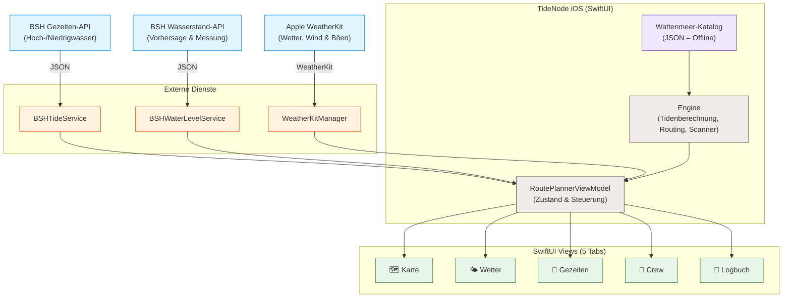
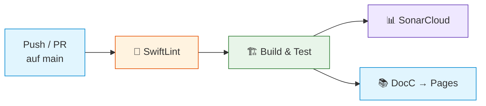

<div align="center">

# TideNode

**Intelligente Törn- & Wattenpassageplanung für die ostfriesischen Inseln**

**Deutsch** · [English](README.en.md)

Eine native iOS-App, die Routen, Gezeiten, Wasserstände, Wetterdaten und Bordinformationen in einer modernen SwiftUI-Oberfläche vereint und daraus eine nachvollziehbare **Go / Warning / No-Go**-Einschätzung berechnet – vollständig offline-fähig mit kuratiertem Wattenmeer-Katalog.

[](https://github.com/everybodydaniel/Toernberechnung-iOS/actions/workflows/ci.yml)
[](https://swift.org)
[](https://developer.apple.com/ios/)
[](#-architektur)
[](https://maplibre.org/)
[](https://everybodydaniel.github.io/Toernberechnung-iOS/documentation/toernberechnung/)
[](LICENSE)

<br/>


<sub><i>Kartenansicht: Route Borkum → Norderney mit nautischer Seekarte, Gezeitenfenster und Go/No-Go-Bewertung</i></sub>

</div>

> ⚠️ **Hinweis:** Die App ist ein Planungstool. Katalogwerte, Peilplanwerte, Wetter- und Gezeitendaten müssen vor der Fahrt skipperseitig mit offiziellen Quellen und der aktuellen Lage abgeglichen werden.

---

## 📑 Inhaltsverzeichnis

- [Überblick](#-überblick)
- [Screenshots](#-screenshots)
- [Highlights](#-highlights)
- [Systemarchitektur](#-systemarchitektur)
- [Datenquellen](#-datenquellen)
- [Technologie-Stack](#-technologie-stack)
- [Projektstruktur](#-projektstruktur)
- [Setup & Installation](#-setup--installation)
- [Code Quality](#-code-quality)
- [Tests](#-tests)
- [CI/CD Pipeline](#-cicd-pipeline)
- [Dokumentation](#-dokumentation)
- [Versionierung](#-versionierung)
- [Lizenz](#-lizenz)

---

## 🎯 Überblick

TideNode ist eine native iOS-App für die **Planung von Segeltörns und Wattenpassagen** zwischen den ostfriesischen Inseln. Die App richtet sich an Skipper, die eine zuverlässige, datenbasierte Entscheidungsgrundlage für ihre Fahrt benötigen.

Die Anwendung folgt einer klar entkoppelten **MVVM-Architektur** mit fünf Hauptbereichen:

- **Karte** – Nautische Seekarte mit Routenplanung, Wegpunkten und Go/No-Go-Bewertung
- **Wetter** – Apple-WeatherKit-Prognosen mit 48-Stunden-Wind- und Böendarstellung in Knoten
- **Gezeiten** – BSH-Gezeitenabruf mit astronomischen Hoch-/Niedrigwasserzeiten und Wasserstandsvorhersage
- **Crewspace** – Crewverwaltung mit Rollen (Skipper, Co-Skipper, Navigation), Notfallkontakten und Bordstatus sowie lokale Terminplanung
- **Logbuch** – Vollständiges Schiffstagebuch mit PDF-Export und Auditprotokoll via SwiftData

---

## 📱 Screenshots

<div align="center">

<table>
  <tr>
    <td align="center"><br/><sub><b>Karte</b><br/>Route & Passage</sub></td>
    <td align="center"><br/><sub><b>Wetter</b><br/>WeatherKit-Prognose</sub></td>
    <td align="center"><br/><sub><b>Gezeiten</b><br/>BSH-Tidenkalender</sub></td>
  </tr>
  <tr>
    <td align="center"><br/><sub><b>Crew</b><br/>Crewverwaltung</sub></td>
    <td align="center"><br/><sub><b>Logbuch</b><br/>Schiffstagebuch</sub></td>
    <td></td>
  </tr>
</table>

</div>

---

## ✨ Highlights

| | Feature | Beschreibung |
|---|---|---|
| 🗺️ | **Nautische Seekarte** | MapLibre-basierte Kartenansicht mit Routendarstellung, Wegpunkten, Schutzzonenmarkierung und Vollbildmodus |
| 🧮 | **Gezeitenbasierte Berechnung** | Automatische Berechnung von Fallhöhe (FmW), Wassertiefe (WT) und Wassersäule über Kiel (WuK) nach der Zwölftelregel |
| 🔍 | **Passagefenster-Scanner** | Automatische Suche nach dem nächsten sicheren Abfahrtsfenster basierend auf Gezeiten und Wasserstand |
| 🌊 | **BSH-Gezeitendaten** | Echtzeit-Abruf astronomischer Hoch-/Niedrigwasservorhersagen und Wasserstandskurven vom BSH |
| 🌤️ | **Apple WeatherKit** | Aktuelles Wetter, 48-Stunden-Windprognose und 7-Tage-Vorhersage für alle ostfriesischen Inseln |
| ✨ | **Nauti On-Device** | Lokale Skipper-Assistenz über Apple Foundation Models auf unterstützten iOS-26-Geräten, ohne Übertragung des Chatverlaufs an einen KI-Server |
| 🚦 | **Go / Warning / No-Go** | Kombinierte Bewertung aus Gezeiten- und Wetterstatus zu einer klaren Passage-Empfehlung |
| 🧭 | **Mehrstrecken-Routing** | Routenplanung mit Zwischenstopps und automatischer Streckenberechnung über den Wattenmeer-Katalog |
| 👥 | **Crewspace** | Rollen (Skipper, Co-Skipper, Navigation), Notfallkontakte, Bordstatus und Terminplanung — vollständig auf dem Gerät |
| 📒 | **Digitales Logbuch** | Schiffstagebuch mit vollständiger Reisehistorie und PDF-Export via SwiftData |
| 🗃️ | **Offline-Katalog** | Kuratierter Wattenmeer-Katalog mit 20+ Routen, Wegpunkten und Tiefenwerten |

---

## 🏗️ Systemarchitektur

Die App folgt einer **MVVM-Architektur** mit strikter Trennung zwischen UI-Schicht, Geschäftslogik und externen Diensten. Der kuratierte Wattenmeer-Katalog ermöglicht die Kernberechnung auch ohne Netzwerkverbindung.



### Schlüsselkomponenten

| Schicht | Verantwortung |
|---|---|
| **Views** | SwiftUI-Oberfläche mit 5-Tab-Navigation, MapLibre-Kartenansicht und Liquid-Glass-Styling |
| **ViewModel** | `RoutePlannerViewModel` – zentraler Zustand, Berechnungssteuerung und Datenabruf |
| **Engine** | Tidenberechnung (Zwölftelregel), Routenplanung, Passagefenster-Scan und Statuskombination |
| **Services** | Clients für BSH-Gezeiten, BSH-Wasserstand und Apple WeatherKit sowie lokale Nauti-Inferenz |
| **Resources** | Kuratierter Wattenmeer-Katalog, GeoJSON-Schutzgebietsdaten und nautische Kartenressourcen |

---

## 🌐 Datenquellen

| Quelle | Bereitgestellte Daten | Verarbeitung |
|---|---|---|
| **BSH Gezeiten** | Astronomische Hoch-/Niedrigwasser-Vorhersagen für Inselpegel | JSON-Abruf, Parsing der HW/NW-Zeiten und -Höhen |
| **BSH Wasserstand** | Wasserstandsvorhersage und -messung (SKN-Bezug) | Zeitreihen-Abruf, Darstellung als Verlaufskurve |
| **Apple WeatherKit** | Aktuelles Wetter, Wind, Böen, Niederschlag sowie Stunden- und Tagesprognosen | Native async/await-Abfragen, nautische Einheiten und lokaler Cache |
| **Apple Foundation Models** | Lokales Sprachverständnis für Nauti, Törn-Intents und allgemeine Seefragen | Vollständig auf dem Gerät; strukturierte Swift-Ausgaben ohne KI-Netzwerkaufruf |
| **Lokaler Katalog** | 20+ Routen, Wegpunkte, Tiefenwerte und Pegel | Offline-JSON mit vorberechneten Katalogdaten |

> Die Kernberechnung und Nauti-Antworten funktionieren auf unterstützten Geräten lokal. Gezeiten- und Wetterdaten erfordern weiterhin eine aktive Internetverbindung; Crew, Termine und Logbuch bleiben vollständig auf dem Gerät.

---

## 🧰 Technologie-Stack

### App-Plattform
- **Sprache:** Swift 5.9
- **UI-Framework:** SwiftUI mit Liquid-Glass-Styling
- **Mindestversion:** iOS 18.0
- **Persistenz:** SwiftData (Logbuch, Crew, Audit-Log)

### Kartendarstellung
- **Rendering:** MapLibre GL Native 6.26+
- **Kartentyp:** Nautische Seekarte mit GeoJSON-Overlays
- **Schutzgebietsdaten:** Nordseebefundverordnung (GeoJSON)

### Externe Dienste
- **Gezeiten:** BSH Gezeiten-API + BSH Wasserstand-API
- **Wetter und Wind:** Apple WeatherKit
- **Lotungen:** Wattseglervereinigung Lotungsdaten

### Lokale KI
- **Framework:** Apple Foundation Models auf iOS 26
- **Datenschutz:** Nauti-Prompts und Antworten verlassen das Gerät nicht
- **Fallback:** Auf nicht unterstützten Geräten bleiben alle manuellen Funktionen verfügbar; es gibt keinen Remote-KI-Fallback

### Berechnungs-Engine
- **Tidenberechnung:** Zwölftelregel für Wasserstandsinterpolation
- **Strategien:** MHW-basiert und Lottiefe-basiert
- **Routing:** Mehrstrecken-Berechnung mit automatischer Routenexpansion
- **Scanner:** Passagefenster-Suche über konfigurierbare Zeiträume

### Werkzeuge
- **Projektgenerierung:** XcodeGen 2.30+
- **Code-Analyse:** SwiftLint
- **Dokumentation:** DocC (automatisch via GitHub Pages)
- **CI/CD:** GitHub Actions (SwiftLint → Build & Test → SonarCloud → DocC Deploy)
- **Dependencies:** Swift Package Manager (MapLibre)

---

## 📂 Projektstruktur

```text
Toernberechnung-iOS/
├── Toernberechnung/
│   ├── ToernberechnungApp.swift        # App-Einstiegspunkt und SwiftData-Konfiguration
│   ├── Views/
│   │   ├── ContentView.swift           # Hauptansicht mit Tab-Navigation
│   │   ├── ContentView+MapTab.swift    # 🗺️ Karten-Tab: Route, Seekarte, Go/No-Go
│   │   ├── ContentView+Weather.swift   # 🌤️ Revier-Tab: WeatherKit, Wind und Böen
│   │   ├── WeatherDetailViews.swift    # Windkarte, Charts und Tagesdetails
│   │   ├── ContentView+Tides.swift     # 🌊 Gezeiten-Tab: BSH-Tiden, Wasserstandskurve
│   │   ├── ContentView+Crew.swift      # 👥 Crew-Tab: Rollen, Notfallkontakte, Bordstatus
│   │   ├── ContentView+Logbook.swift   # 📒 Logbuch-Tab: Reisehistorie, PDF-Export
│   │   ├── ContentView+RouteDetail.swift   # Routendetails und Berechnungsergebnisse
│   │   ├── ContentView+SharedUI.swift  # Gemeinsame UI-Komponenten
│   │   ├── CalculatorResultsSection.swift  # Detaillierte Berechnungsergebnisse
│   │   ├── MapView.swift               # MapLibre-Kartenintegration
│   │   ├── FullScreenMapView.swift     # Vollbild-Kartenansicht
│   │   ├── FullScreenNavigationView.swift  # Vollbild-Navigation
│   │   ├── LiquidGlassStyle.swift      # Glasmorphismus-UI-Styles
│   │   └── WebView.swift               # Eingebettete Webansicht
│   ├── Engine/
│   │   ├── RoutePlannerViewModel.swift  # MVVM-ViewModel: Zustand und Berechnungssteuerung
│   │   ├── RouteCalculationService.swift    # Kernberechnung: Zeiten, Tiefen, Status
│   │   ├── RoutePlanModels.swift        # Datenmodelle für Routen und Ergebnisse
│   │   ├── TidalHeightStrategy.swift    # MHW- und Lottiefe-Strategien
│   │   ├── RuleOfTwelfths.swift         # Zwölftelregel-Implementation
│   │   ├── PassageWindowScanner.swift   # Automatische Abfahrtsfenster-Suche
│   │   ├── SeaRoutePlanner.swift        # Seekarten-Routenplanung
│   │   ├── NauticalRouter.swift         # Nautisches Routing mit Wegpunkten
│   │   ├── RouteExpander.swift          # Automatische Routenexpansion
│   │   ├── RouteSummary.swift           # Zusammenfassung der Routenberechnung
│   │   ├── WaddenSeaCatalog.swift       # Wattenmeer-Katalog-Parser
│   │   ├── ProtectedZoneCatalog.swift   # Schutzzonen-Verwaltung
│   │   ├── NavigationTracker.swift      # GPS-Positionsverfolgung
│   │   ├── ActiveVoyageManager.swift    # Aktive Reiseverwaltung
│   │   ├── AppDateFormatters.swift      # Zentrale Datumsformatierung
│   │   ├── HarbourCatalog.swift         # Neutraler Hafen- und Koordinatenkatalog
│   │   ├── MarineWeatherModels.swift    # Nautische Wetter-Domänenmodelle
│   │   ├── NautiModels.swift            # Typisierte lokale KI-Aktionen und Verfügbarkeit
│   │   ├── NautiChatViewModel.swift     # Chat-Zustand ohne Netzwerkabhängigkeit
│   │   └── Routing/                     # Routing-Algorithmen und Graphen
│   ├── Services/
│   │   ├── BSHTideService.swift         # BSH-Gezeiten-API-Client
│   │   ├── BSHWaterLevelService.swift   # BSH-Wasserstand-Messdaten
│   │   ├── BSHWaterLevelForecastService.swift  # BSH-Wasserstandsvorhersage
│   │   ├── WeatherKitManager.swift      # Apple-WeatherKit-Client und Cache
│   │   ├── LocalAIInferenceManager.swift # Apple-Foundation-Models-Inferenz
│   │   ├── WattseglerLotungenService.swift  # Wattseglervereinigung-Lotungen
│   │   ├── EmdenPlantabelleService.swift    # Emden-Plantabelle
│   │   ├── TideDataProvider.swift       # Abstrahierter Gezeitendaten-Provider
│   │   └── LocationService.swift        # GPS-Ortungsdienst
│   └── Resources/
│       ├── wadden_sea_catalog.json      # Kuratierter Wattenmeer-Katalog
│       ├── east_frisia.geojson          # Ostfriesland-Regionsdaten
│       ├── east_frisia_osm.geojson      # OSM-basierte Kartendetails
│       ├── nordsbefv.geojson            # Nordseebefundverordnung-Schutzzonen
│       └── nordsbefv_eastfrisia.geojson # Schutzgebiete Ostfriesland
├── ToernberechnungTests/
│   └── RouteCalculationTests.swift      # Unit-Tests für Kern-Engine
├── .github/workflows/
│   └── ci.yml                           # CI: SwiftLint → Build & Test → SonarCloud → DocC
├── .swiftlint.yml                       # SwiftLint-Konfiguration
├── project.yml                          # XcodeGen-Projektdefinition
├── Gemfile                              # Ruby-Abhängigkeiten (Fastlane)
├── fastlane/                            # Fastlane-Konfiguration
└── LICENSE                              # MIT-Lizenz
```

---

## 🚀 Setup & Installation

### Voraussetzungen

| Tool | Version |
|---|---|
| Xcode | 16.0+ |
| iOS Target | 18.0+ |
| Swift | 5.9 |
| XcodeGen | 2.30+ *(optional)* |
| SwiftLint | Latest *(empfohlen)* |

### 1 · Repository klonen

```bash
git clone https://github.com/everybodydaniel/Toernberechnung-iOS.git
cd Toernberechnung-iOS
```

### 2 · Xcode-Projekt generieren (optional)

Das `.xcodeproj` ist im Repository enthalten. Bei Änderungen an `project.yml` neu generieren:

```bash
# XcodeGen installieren (falls nötig)
brew install xcodegen

# Projekt generieren
xcodegen generate
```

### 3 · Projekt öffnen & bauen

```bash
open Toernberechnung.xcodeproj
```

Die Dependency (MapLibre) wird automatisch über **Swift Package Manager** aufgelöst.

### 4 · WeatherKit aktivieren

Aktiviere **WeatherKit** unter *Signing & Capabilities* für das App-Target sowie für die zugehörige App ID im Apple Developer Portal. Erzeuge danach bei Bedarf das Provisioning Profile neu.

### 5 · SwiftLint installieren (empfohlen)

```bash
brew install swiftlint
```

> SwiftLint wird als Build-Phase automatisch ausgeführt, sofern installiert. Ohne SwiftLint läuft der Build trotzdem durch – es erscheint nur eine Warnung.

---

## 🧹 Code Quality

### SwiftLint

Das Projekt nutzt [SwiftLint](https://github.com/realm/SwiftLint) für statische Code-Analyse. Die Konfiguration liegt in `.swiftlint.yml`.

```bash
# Lokal ausführen
swiftlint lint --config .swiftlint.yml

# Automatische Korrektur (wo möglich)
swiftlint --fix --config .swiftlint.yml
```

### DocC-Dokumentation

Swift-Quellcode ist mit `///`-DocC-Kommentaren dokumentiert. Dokumentation kompilieren:

```bash
# Via Xcode: Product → Build Documentation (⌃⇧⌘D)

# Via Terminal
xcodebuild docbuild \
  -project Toernberechnung.xcodeproj \
  -scheme Toernberechnung \
  -destination 'platform=iOS Simulator,name=iPhone 16'
```

---

## 🧪 Tests

Unit-Tests liegen unter `ToernberechnungTests/` und decken ab:

- Zwölftelregel und Hochwasserabweichungen
- Reisezeiten, SOG und Etappenberechnung
- Kombination von Gezeiten- und Wetterstatus
- Regression für Emden → Norderney
- Laden und Konsistenz des Wattenmeer-Katalogs

```bash
# Tests über CLI ausführen
xcodebuild test \
  -project Toernberechnung.xcodeproj \
  -scheme Toernberechnung \
  -destination 'platform=iOS Simulator,name=iPhone 16'
```

---

## ⚙️ CI/CD Pipeline

Die GitHub Actions Pipeline (`.github/workflows/ci.yml`) führt bei jedem Push/PR auf `main` aus:

| Job | Beschreibung |
|---|---|
| 🧹 **SwiftLint** | Statische Code-Analyse mit GitHub Actions Logging |
| 🏗️ **Build & Test** | Kompilierung, SPM-Auflösung und Unit Tests auf iOS Simulator |
| 📊 **SonarCloud** | Automatisierte Code-Qualitätsanalyse mit Test-Reports |
| 📚 **DocC Deploy** | Dokumentations-Build und Deployment auf GitHub Pages |



> Alle Actions sind auf volle Commit-SHAs gepinnt (Supply-Chain-Sicherheit).

---

## 📚 Dokumentation

Die gesamte Codebasis ist nach DocC-Standard dokumentiert. Die statische Dokumentationswebsite wird bei jedem Push automatisch auf GitHub Pages veröffentlicht:

👉 **[DocC-Dokumentation](https://everybodydaniel.github.io/Toernberechnung-iOS/documentation/toernberechnung/)**

Lokale Generierung:

```bash
xcodebuild docbuild \
  -project Toernberechnung.xcodeproj \
  -scheme Toernberechnung \
  -destination 'platform=iOS Simulator,name=iPhone 16'
```

---

## 🔢 Versionierung

Das Projekt nutzt [Semantic Versioning](https://semver.org/) (`MAJOR.MINOR.PATCH`):

| Xcode-Feld | Bedeutung | Beispiel |
|---|---|---|
| `MARKETING_VERSION` | Öffentliche Version (SemVer) | `1.0` |
| `CURRENT_PROJECT_VERSION` | Build-Nummer (inkrementell) | `1` |


## 📄 Lizenz

Veröffentlicht unter der **MIT-Lizenz**. Die vollständigen Bedingungen finden sich in der Datei [LICENSE](LICENSE).

<div align="center">

---

<sub>Copyright © 2026 everybodydaniel</sub><br/>
<sub>Hochschule Osnabrück · Campus Lingen</sub>

</div>
